<div align="center">

**[Назва університету]**

**[Назва кафедри]**

<br><br><br>

# ЗВІТ

## до лабораторної роботи №1

### з дисципліни «[Назва дисципліни]»

### на тему: «Побудова та аналіз моделей ШІ з використанням TensorFlow»

<br><br><br>

</div>

<div align="right">

**Виконав:** студент групи [група]<br>
Каспрович Р. Б.

**Перевірив:** [посада, ПІБ викладача]

</div>

<div align="center">

<br><br>

[Місто] — 2026

</div>

---

## Мета роботи

Опанувати практику створення й оптимізації моделей машинного навчання у **TensorFlow / Keras**. Навчитися застосовувати різні архітектури, регуляризацію та методи покращення узагальнюючої здатності моделі. Виконати порівняльний аналіз результатів.

> Відповідно до завдання, у лабораторній роботі №1 усі пункти виконано на TensorFlow. Порівняння TensorFlow і PyTorch (п.11, частково п.12) буде у висновках лабораторної роботи №2. Для порівняння збережено навчені моделі (`artifacts/saved_models/*.keras`) і зафіксовано seed.

---

## Хід роботи

### Крок 1. Середовище та структура проєкту

- Python 3, **TensorFlow 2.21**, scikit-learn 1.9, imbalanced-learn, pandas, matplotlib, seaborn.
- Запуск: `python main.py`. Весь конвеєр (EDA → препроцесинг → навчання 6 моделей → графіки → таблиці) виконується однією командою.
- **Відтворюваність:** глобальний seed `42` (`tf.keras.utils.set_random_seed`) встановлюється на старті та повторно перед кожним експериментом. Повторний запуск дає побітово ідентичні метрики (перевірено двома прогонами).

```text
main.py                       # оркестратор пайплайна
src/config/app_config.py      # гіперпараметри (frozen dataclasses)
src/data/loader.py            # завантаження/кешування датасету
src/data/preprocessor.py      # дедуплікація, split, scaling, SMOTE
src/eda/analyzer.py           # EDA та графіки
src/models/builder.py         # Baseline і Regularized архітектури
src/training/trainer.py       # навчання, підбір порогу, діагностика перенавчання
src/training/evaluator.py     # метрики для незбалансованої класифікації
src/visualization/plots.py    # криві навчання, ROC/PR, матриці помилок
```

### Крок 2. Вибір набору даних

Обрано **Credit Card Fraud Detection** (Kaggle, ULB). Це бінарна класифікація з сильним дисбалансом класів.

| Характеристика | Значення |
| :--- | :--- |
| Кількість транзакцій | 284 807 |
| Вхідні ознаки | 30: `Time`, `Amount`, `V1`–`V28` (PCA-компоненти) |
| Клас 0 (легітимні) | 284 315 (99.827%) |
| Клас 1 (шахрайство) | 492 (0.173%) |
| Співвідношення класів | ≈ 1 : 578 |
| Пропущені значення | 0 |

Через такий дисбаланс **Accuracy неінформативна**: модель, яка завжди відповідає «0», отримує 99.83%. Тому основні метрики тут **Precision, Recall, F1-Score та PR-AUC**.

### Крок 3. Розвідувальний аналіз даних (EDA)

**3.1. Дисбаланс класів.** Розподіл класів показано в лінійному та логарифмічному масштабі. У лінійному шахрайський клас майже не видно.

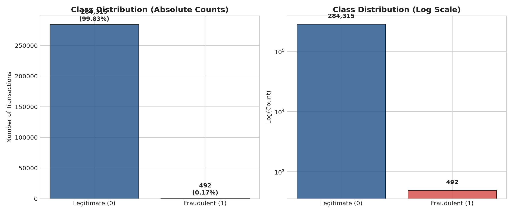

**3.2. Розподіл усіх ознак.** Гістограми всіх 30 ознак з логарифмічною віссю частот і коефіцієнтом асиметрії (skew). `Amount` має сильну правосторонню асиметрію і викиди, тому для неї обрано `RobustScaler`. `V1`–`V28` центровані біля нуля (результат PCA), але багато з них мають важкі хвости.

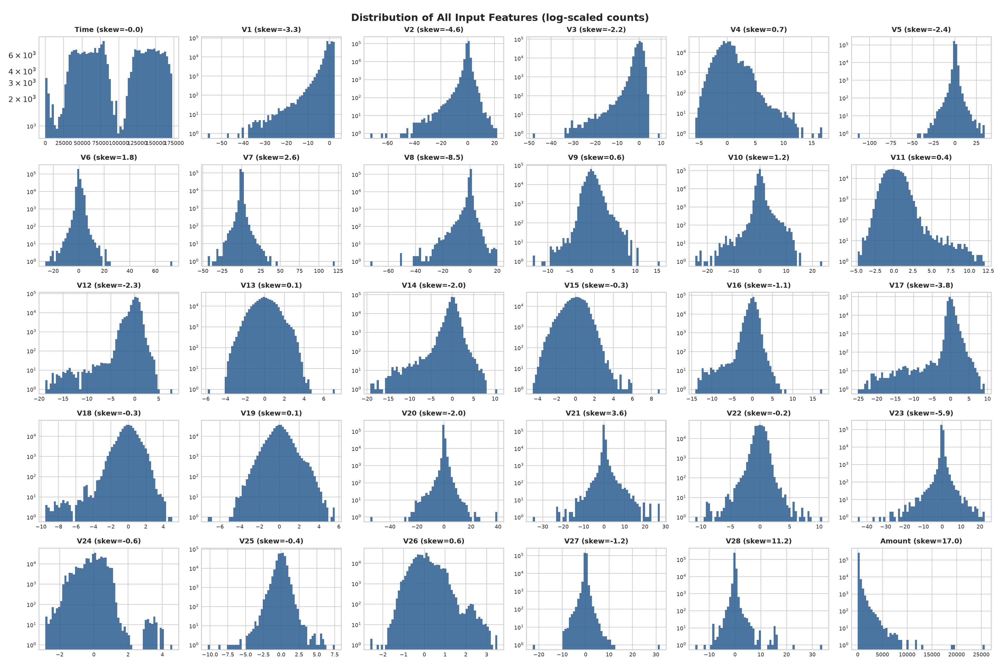

**3.3. Розподіл найінформативніших ознак за класами (KDE).** Для `V14`, `V17`, `V12` розподіл шахрайських транзакцій помітно зсунутий у від'ємний бік, для `V4` у додатний. Саме ці ознаки найкраще розділяють класи.

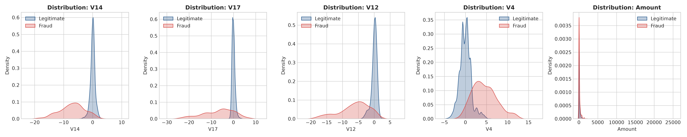

**3.4. Кореляційний аналіз.** Кореляційна матриця Пірсона 31×31 і топ ознак, корельованих із `Class`. Ознаки `V1`–`V28` між собою майже не корелюють, бо PCA-компоненти ортогональні. Найсильніша кореляція з цільовою змінною: `V17`, `V14`, `V12` (від'ємна) та `V11`, `V4` (додатна). За модулем кореляції не перевищують ~0.33, тобто залежність нелінійна і слабо виражена. Це аргумент на користь нейромережі замість лінійної моделі.

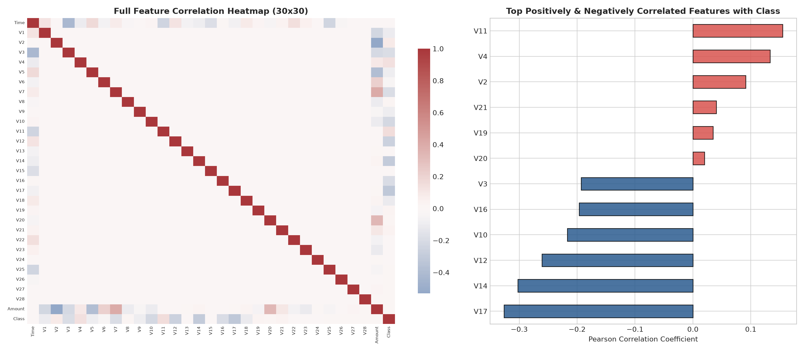

### Крок 4. Попередня обробка даних

1. **Видалення дублікатів.** У датасеті 1 081 повністю ідентичний рядок, з них 19 шахрайських. Без видалення той самий запис може потрапити і в train, і в test, що завищує метрики. Після дедуплікації лишилося 283 726 записів.
2. **Масштабування.** `Time` і `Amount` масштабуються через `RobustScaler` (медіана/IQR, стійкий до викидів). `V1`–`V28` уже стандартизовані PCA. Scaler навчається **тільки на train** (`fit_transform`), до val/test застосовується лише `transform`, тож витоку даних немає.
3. **Балансування SMOTE.** Застосовано **тільки до train** з `sampling_strategy=0.2`: кількість шахрайських прикладів збільшено до 20% від легітимних. Val і test зберігають реальний розподіл, щоб оцінка відповідала бойовим умовам.

```python
# src/data/preprocessor.py — масштабування без витоку даних
for col, scaler in [("Time", self._time_scaler), ("Amount", self._amount_scaler)]:
    x_train_df[col] = scaler.fit_transform(x_train_df[[col]])   # fit тільки на train
    x_val_df[col] = scaler.transform(x_val_df[[col]])
    x_test_df[col] = scaler.transform(x_test_df[[col]])

# SMOTE — тільки на тренувальній вибірці
x_train_balanced, y_train_balanced = self._balancing_strategy.balance(x_train, y_train_arr)
```

### Крок 5. Train / Validation / Test split

Стратифікований поділ (`stratify=y`) у пропорції 70 / 15 / 15:

| Вибірка | До SMOTE | Після SMOTE | Шахрайських |
| :--- | ---: | ---: | ---: |
| Train | 198 608 | 237 932 | 331 → 39 655 |
| Validation | 42 559 | — | 71 |
| Test | 42 559 | — | 71 |

> У тестовій вибірці лише **71** шахрайська транзакція. Один правильно чи неправильно класифікований приклад змінює Recall на ≈1.4 п.п., і це треба враховувати, коли порівнюєш близькі результати.

### Крок 6. Архітектури нейронних мереж

**Архітектура 1: базова feedforward мережа (Baseline FFN).** Два приховані шари, без регуляризації.

```
Input(30) → Dense(64, act) → Dense(32, act) → Dense(1, sigmoid)
```

**Архітектура 2: ускладнена мережа (Regularized).** Dropout, Batch Normalization та L2-регуляризація.

```
Input(30) → [Dense(64, L2=1e-4, no bias) → BatchNorm → act → Dropout(0.3)]
          → [Dense(32, L2=1e-4, no bias) → BatchNorm → act → Dropout(0.3)]
          → Dense(1, sigmoid)
```

```python
# src/models/builder.py — RegularizedModelBuilder.build()
l2_reg = regularizers.l2(self._l2_factor)
for idx, units in enumerate(self._hidden_units, start=1):
    model.add(layers.Dense(units, kernel_regularizer=l2_reg, use_bias=False, name=f"dense_{idx}"))
    model.add(layers.BatchNormalization(name=f"batch_norm_{idx}"))
    if self._activation == "leaky_relu":
        model.add(layers.LeakyReLU(name=f"leaky_relu_{idx}"))
    elif self._activation == "gelu":
        model.add(layers.Activation("gelu", name=f"gelu_{idx}"))
    else:
        model.add(layers.Activation("relu", name=f"relu_{idx}"))
    model.add(layers.Dropout(self._dropout_rate, name=f"dropout_{idx}"))
model.add(layers.Dense(1, activation="sigmoid", name="output_layer"))
```

`use_bias=False` перед BatchNorm використано тому, що BN має власний зсув (β), і bias Dense-шару був би зайвим.

### Крок 7. Функції активації

Кожну з двох архітектур навчено з **усіма трьома** активаціями, разом **6 експериментів**:

| Активація | Формула | Особливість |
| :--- | :--- | :--- |
| **ReLU** | max(0, x) | проста й швидка; нейрони можуть «вмирати» (нульовий градієнт при x<0) |
| **LeakyReLU** | max(αx, x), α=0.2 (Keras 3) | невеликий градієнт при x<0 запобігає «мертвим» нейронам |
| **GELU** | x·Φ(x) | гладка, стандарт у трансформерах |

```python
# main.py — 2 архітектури × 3 активації
activations = ["relu", "leaky_relu", "gelu"]
model_builders = [
    *(BaselineModelBuilder(activation=act, hidden_units=[64, 32]) for act in activations),
    *(RegularizedModelBuilder(activation=act, hidden_units=[64, 32], dropout_rate=0.3, l2_factor=1e-4)
      for act in activations),
]
```

### Крок 8. Навчання з фіксованими гіперпараметрами

Для всіх 6 моделей гіперпараметри однакові:

| Параметр | Значення |
| :--- | :--- |
| Епохи | 15 |
| Optimizer | Adam |
| Learning rate | 0.001 |
| Batch size | 512 |
| Loss | Binary Cross-Entropy |
| Seed | 42 (перед кожним експериментом) |

### Крок 9. Метрики якості

Оцінка проводилась на **незалежній тестовій вибірці** (42 559 транзакцій, 71 шахрайство). Через дисбаланс використано Precision, Recall, F1, ROC-AUC, PR-AUC (Average Precision) та матрицю помилок.

**Поріг класифікації.** SMOTE змінює апріорну частку шахрайства з 0.17% до ~17%, тому ймовірності мережі зміщені вгору і стандартний поріг 0.5 дає забагато хибних тривог. Тому для кожної моделі додатково підібрано **F1-оптимальний поріг на валідаційній вибірці**. Test-вибірка в підборі не бере участі, тож витоку немає.

```python
# src/training/trainer.py — поріг підбирається на val, оцінка на test
val_pred_proba = model.predict(data.x_val, batch_size=self._config.batch_size, verbose=0)
tuned_threshold = MetricsEvaluator.find_best_f1_threshold(data.y_val, val_pred_proba)
test_metrics_tuned = MetricsEvaluator.evaluate(builder.name, data.y_test, test_pred_proba,
                                               threshold=tuned_threshold)
```

**Таблиця 1. Тестові метрики при порозі 0.5**

| Модель | Precision | Recall | F1 | ROC-AUC | PR-AUC | TP | FP | FN |
| :--- | :---: | :---: | :---: | :---: | :---: | :---: | :---: | :---: |
| Baseline ReLU | **0.707** | 0.746 | **0.726** | 0.957 | 0.750 | 53 | **22** | 18 |
| Baseline LeakyReLU | 0.596 | 0.789 | 0.679 | 0.953 | **0.768** | 56 | 38 | 15 |
| Baseline GELU | 0.576 | 0.746 | 0.650 | 0.946 | 0.761 | 53 | 39 | 18 |
| Regularized ReLU | 0.582 | 0.803 | 0.675 | **0.959** | 0.759 | 57 | 41 | 14 |
| Regularized LeakyReLU | 0.526 | **0.845** | 0.649 | 0.957 | 0.705 | **60** | 54 | **11** |
| Regularized GELU | 0.504 | 0.831 | 0.628 | 0.958 | 0.767 | 59 | 58 | 12 |

**Таблиця 2. Тестові метрики при F1-оптимальному порозі (підібраному на validation)**

| Модель | Поріг | Precision | Recall | F1 | TP | FP | FN |
| :--- | :---: | :---: | :---: | :---: | :---: | :---: | :---: |
| Baseline ReLU | 0.871 | 0.785 | 0.718 | 0.750 | 51 | 14 | 20 |
| Baseline LeakyReLU | 0.992 | 0.803 | 0.746 | 0.774 | 53 | 13 | 18 |
| Baseline GELU | 0.954 | 0.800 | 0.732 | 0.765 | 52 | 13 | 19 |
| Regularized ReLU | 0.964 | 0.815 | 0.746 | 0.779 | 53 | 12 | 18 |
| Regularized LeakyReLU | 0.983 | 0.821 | **0.775** | **0.797** | **55** | 12 | **16** |
| Regularized GELU | 0.965 | **0.825** | 0.732 | 0.776 | 52 | **11** | 19 |

ROC-AUC і PR-AUC від порогу не залежать і збігаються з таблицею 1.

**Матриці помилок при порозі 0.5:**

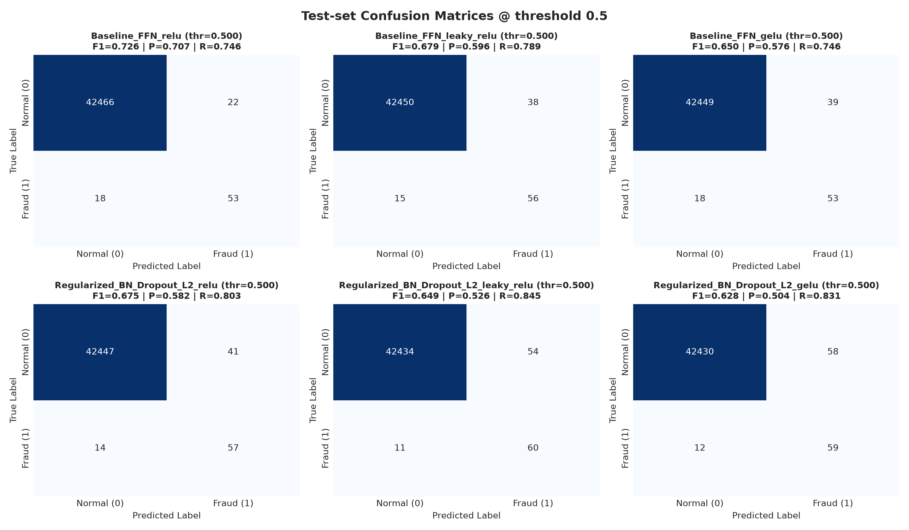

**Матриці помилок при порозі, підібраному на validation** (за ними обрано найкращу модель; Regularized LeakyReLU: 55 TP, 12 FP, 16 FN):

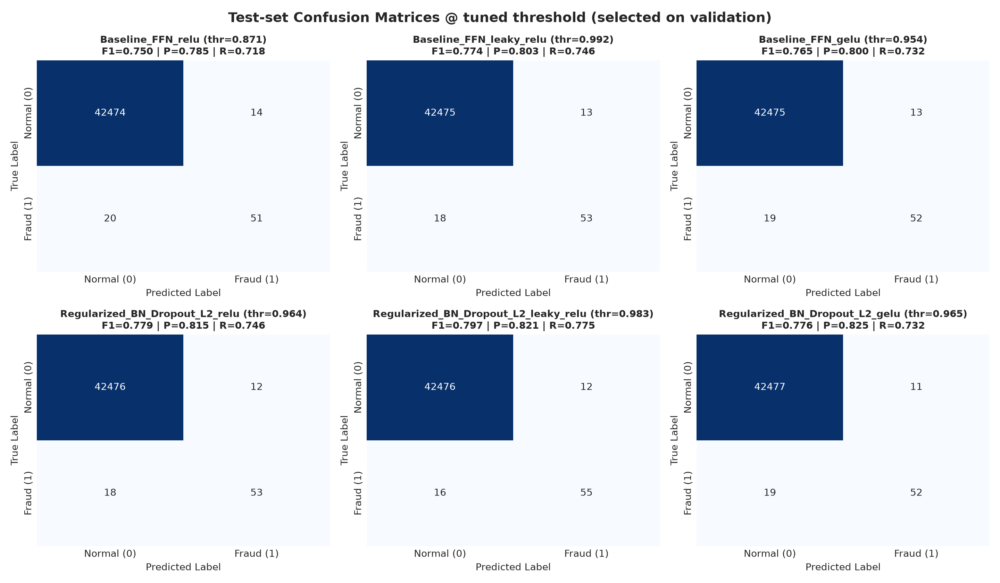

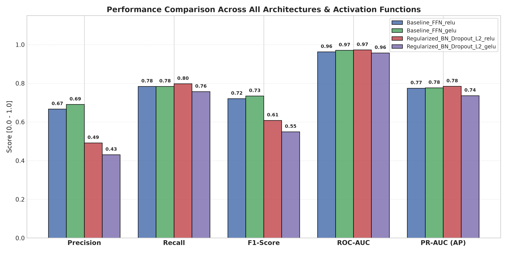

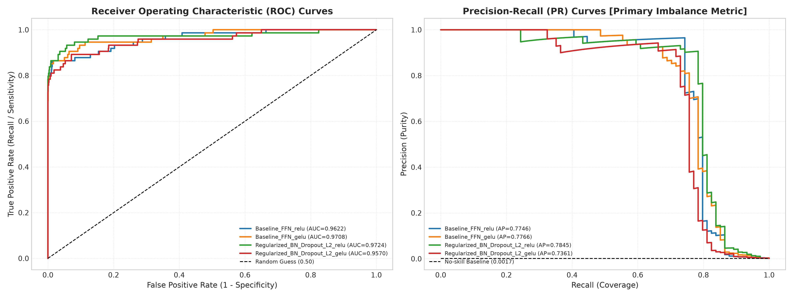

### Крок 10. Навчальні криві

Окремий графік train/val для кожної моделі. Вертикальна лінія позначає епоху з мінімальним val loss.

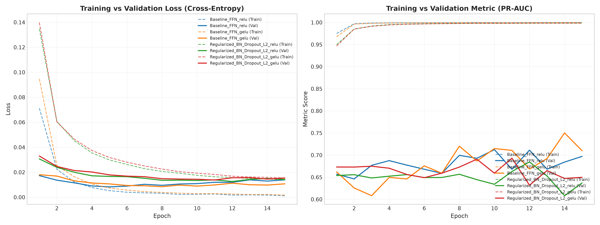

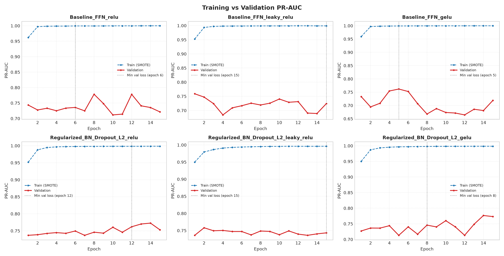

**Таблиця 3. Діагностика пере- та недонавчання**

| Модель | Train loss (15 еп.) | Val loss (15 еп.) | Мін. val loss | Епоха мінімуму | Ріст val loss після мінімуму |
| :--- | :---: | :---: | :---: | :---: | :---: |
| Baseline ReLU | 0.0009 | 0.0102 | 0.0077 | 6 | **+32.3%** |
| Baseline LeakyReLU | 0.0034 | 0.0082 | 0.0082 | 15 | 0% |
| Baseline GELU | 0.0013 | 0.0116 | 0.0079 | 5 | **+46.0%** |
| Regularized ReLU | 0.0128 | 0.0117 | 0.0106 | 12 | +11.0% |
| Regularized LeakyReLU | 0.0258 | 0.0126 | 0.0126 | 15 | 0% |
| Regularized GELU | 0.0137 | 0.0134 | 0.0120 | 8 | +11.3% |

### Крок 11. Скріншоти виконання програми

**Рис. 1.** Навчання моделі Regularized LeakyReLU (епохи 2–15), підбір порогу на validation та оцінка на тестовій вибірці:

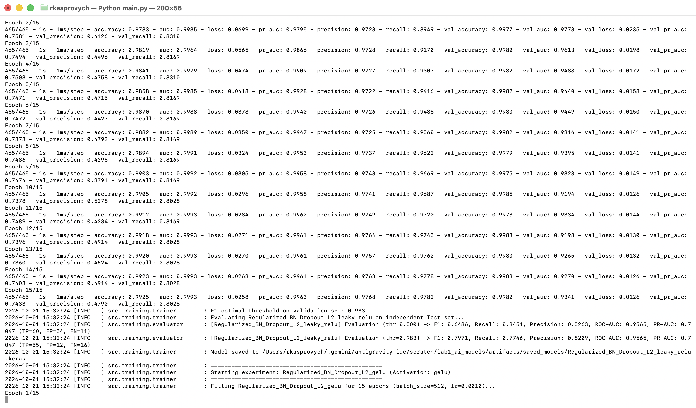

**Рис. 2.** Завершення роботи програми: таблиці тестових метрик при порозі 0.5 і при підібраному порозі, діагностика перенавчання:

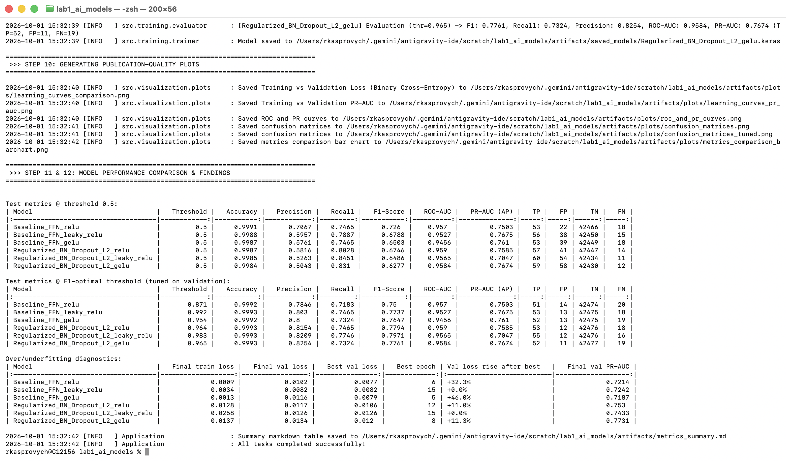

Додатково наведено текстовий фрагмент логу (повний лог у `artifacts/run_output.txt`):

```text
[INFO] Configuration loaded: Epochs=15, BatchSize=512, LearningRate=0.0010, Seed=42
[INFO] Dataset ready: 284807 records, 30 features. Class balance: 0=284315, 1=492 (0.173% fraud)
[INFO] Dataset statistics: Rows=284807, Missing Values=0
[INFO] Removed 1081 duplicate rows (284807 -> 283726)
[INFO] Dataset split completed: Train=198608, Val=42559, Test=42559 (Stratified)
[INFO] SMOTE applied: original 198608 samples -> resampled 237932 samples (positives: 39655)
[INFO] Configured 6 distinct model experiments for training.
...
[INFO] Starting experiment: Regularized_BN_Dropout_L2_leaky_relu (Activation: leaky_relu)
[INFO] Fitting Regularized_BN_Dropout_L2_leaky_relu for 15 epochs (batch_size=512, lr=0.0010)...
[INFO] F1-optimal threshold on validation set: 0.983
[INFO] [Regularized_BN_Dropout_L2_leaky_relu] Evaluation (thr=0.500) -> F1: 0.6486, Recall: 0.8451,
       Precision: 0.5263, ROC-AUC: 0.9565, PR-AUC: 0.7047 (TP=60, FP=54, FN=11)
[INFO] [Regularized_BN_Dropout_L2_leaky_relu] Evaluation (thr=0.983) -> F1: 0.7971, Recall: 0.7746,
       Precision: 0.8209, ROC-AUC: 0.9565, PR-AUC: 0.7047 (TP=55, FP=12, FN=16)
...
[INFO] All tasks completed successfully!
```

---

## Аналіз результатів

### 1. Перенавчання та недонавчання

- **Базова мережа перенавчається.** У ReLU і GELU train loss падає майже до нуля (0.0009–0.0013), а val loss досягає мінімуму на 5–6 епосі і далі росте на 32–46%. Мережа без регуляризації починає запам'ятовувати тренувальні (у тому числі синтетичні SMOTE) приклади. Розрив між train і val loss становить приблизно ×10. Без регуляризації варто було б зупиняти навчання на 5–6 епосі (early stopping).
- **Регуляризація прибирає перенавчання.** У регуляризованих моделях train і val loss майже збігаються (0.0128 / 0.0117 для ReLU), а ріст val loss після мінімуму помірний (~11%). Те, що train loss вищий за val loss, не є помилкою. Причини: (а) Dropout активний тільки під час навчання; (б) до train loss додається L2-штраф; (в) train після SMOTE містить ~17% складних позитивних прикладів, а val лише 0.17%.
- **Ознаки недонавчання.** У Regularized LeakyReLU (і Baseline LeakyReLU) val loss ще падає на 15-й епосі, а train loss найвищий серед усіх (0.0258). Модель не зійшлася за 15 епох, і більше епох, імовірно, ще покращило б результат.
- **Розрив PR-AUC train ≈ 1.0 проти val ≈ 0.72–0.77** пояснюється не лише перенавчанням. На train частка позитивних ~17%, на val 0.17%, а PR-AUC сильно залежить від цієї частки. Тому ці криві не можна порівнювати напряму, коректне порівняння дає лише val/test.

### 2. Базова чи регуляризована архітектура

- **При порозі 0.5** найкращий F1 має Baseline ReLU (0.726), бо вона дає найменше хибних тривог (22 FP). Регуляризовані моделі знаходять більше шахрайств (Recall 0.80–0.85, лише 11–14 FN), але ціною вдвічі більшої кількості FP (41–58). Пояснення: Dropout і L2 роблять вихід мережі менш «упевненим» і згладжують ймовірності, тому після SMOTE більше прикладів перетинає поріг 0.5.
- **Після підбору порогу на validation** регуляризовані моделі кращі за всіх трьох активацій: середній F1 **0.784 проти 0.763** у базових. Найкраща модель, **Regularized LeakyReLU, має F1 = 0.797** (Precision 0.82, Recall 0.77, 55 з 71 шахрайства знайдено при 12 FP).
- **ROC-AUC (0.946–0.959) і PR-AUC (0.70–0.77) у всіх моделей близькі.** Здатність ранжувати транзакції за ризиком в усіх архітектур схожа. Головна різниця в калібруванні ймовірностей і стабільності навчання, а не в «силі» моделі.
- **Висновок.** Для цієї задачі регуляризація (BN + Dropout + L2) разом з підбором порогу працює краще. Вона усуває перенавчання і дає найкращий F1. Якщо оцінювати лише при порозі 0.5, можна помилково зробити висновок на користь базової мережі.

### 3. Порівняння функцій активації

| Активація | F1 Baseline (thr 0.5 → tuned) | F1 Regularized (thr 0.5 → tuned) |
| :--- | :---: | :---: |
| ReLU | 0.726 → 0.750 | 0.675 → 0.779 |
| LeakyReLU | 0.679 → **0.774** | 0.649 → **0.797** |
| GELU | 0.650 → 0.765 | 0.628 → 0.776 |

- Після підбору порогу **LeakyReLU найкраща в обох архітектурах**. Базова мережа з LeakyReLU також єдина не показала перенавчання за 15 епох. Причина не в «стабільнішому» навчанні, а в тому, що з LeakyReLU мережа **збігається повільніше**: її train loss на 15-й епосі у 2–4 рази вищий, ніж у ReLU/GELU (0.0034 проти 0.0009–0.0013), а val loss ще падає (див. розділ 1). Тобто за 15 епох вона просто не дійшла до точки, з якої починається перенавчання. За довшого навчання вона, найімовірніше, теж почала б перенавчатися, і тоді знадобилися б early stopping або регуляризація.
- **GELU** у базовій мережі перенавчається найсильніше (+46% val loss), а після підбору порогу займає проміжне місце.
- **ReLU** найкраща лише при порозі 0.5 у базовій мережі.
- **Застереження.** Різниця між активаціями після підбору порогу становить 0.01–0.03 F1, тобто 1–3 правильно знайдені шахрайства з 71. Це один запуск з одним seed, тому висновок про перевагу LeakyReLU слід вважати тенденцією, а не статистично доведеним фактом. Для строгого висновку потрібно кілька запусків з різними seed. Окремо: PR-AUC у Regularized LeakyReLU найнижчий (0.705), тобто за порогонезалежною метрикою вона не найкраща.

### 4. Що працює краще для цієї задачі

1. **Підбір порогу на validation** дав найбільший приріст якості: F1 +0.02…+0.15 для кожної моделі без жодної зміни архітектури. Після SMOTE це обов'язковий крок.
2. **Регуляризація (BN + Dropout + L2)** усуває перенавчання, яке у базовій мережі починається вже після 5–6 епохи.
3. **LeakyReLU** дає найкращий F1, але перевага невелика і частково пояснюється тим, що за 15 епох ця мережа ще не встигла перенавчитися.
4. **Accuracy (0.998–0.999) не відрізняє моделі** і не підходить для цієї задачі.

---

## Висновки

1. Усі пункти завдання лабораторної роботи №1 виконано на TensorFlow 2.21 / Keras: EDA, препроцесинг (дедуплікація, RobustScaler, SMOTE), стратифікований split 70/15/15, дві архітектури (базова FFN і мережа з BatchNorm + Dropout + L2), порівняння трьох функцій активації (ReLU, LeakyReLU, GELU) для кожної архітектури, навчання 15 епох з фіксованими Adam і lr = 0.001, метрики для незбалансованих даних і навчальні криві.
2. Базова мережа без регуляризації перенавчається після 5–6 епохи (val loss росте на 32–46%). Регуляризована мережа цього не має. LeakyReLU-варіанти збігаються повільніше і за 15 епох ще не дійшли до точки перенавчання.
3. Найкращий результат на тестовій вибірці показала **Regularized LeakyReLU з порогом, підібраним на validation: F1 = 0.797, Precision = 0.821, Recall = 0.775, ROC-AUC = 0.957**.
4. Стандартний поріг 0.5 після SMOTE не оптимальний. Підбір порогу на validation дав більше, ніж вибір архітектури чи активації.
5. Різниця між активаціями мала (≤ 0.03 F1, у межах шуму одного запуску на 71 позитивному прикладі), тому висновок про перевагу LeakyReLU потребує перевірки на кількох seed.
6. Порівняння з PyTorch (п.11–12) буде у лабораторній роботі №2. Для цього збережено всі 6 навчених моделей (`artifacts/saved_models/`), зафіксовано seed і гіперпараметри.
